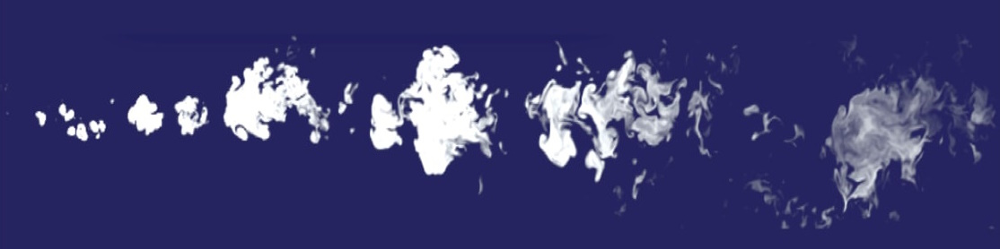

This site contains the documentation for the `olfactory-navigation` framework.

This project consists in a framework that allows one to define an olfactory environment and agents to navigate this environment in order to try and find the source of an odor using exclusively its sense of smell.

We can imagine for instance a dog attempting to find a treat in a field where the wind carries the odor towards him.

The framework aims to allow a user to create agents using different techniques and evaluate its performance (computational and technical) during simulations on olfactory environments.

## Table Of Contents

1. Code Reference

    1.1 [olfactory_navigation](reference/index.md)

2. Tutorials

    2.1 [How to Create an Agent?](agent_creation.md)

## PiMLb

This framework was built as a project within the [PiMLb](https://malga.unige.it/research/pimlb) unit of the [Malga](https://malga.unige.it) lab.