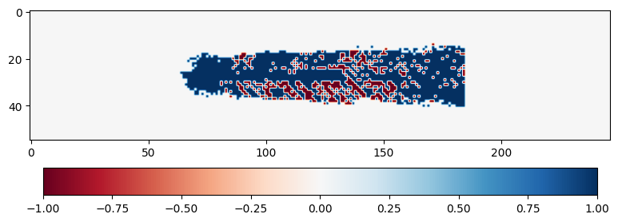
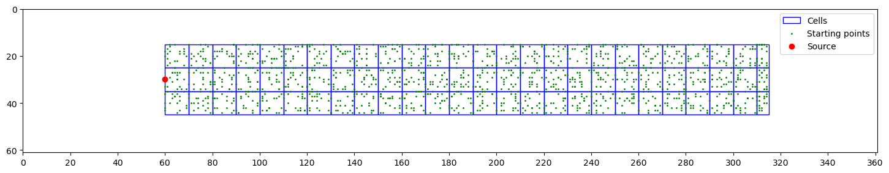
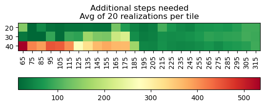
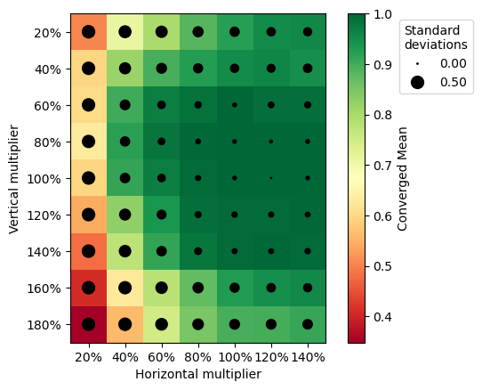
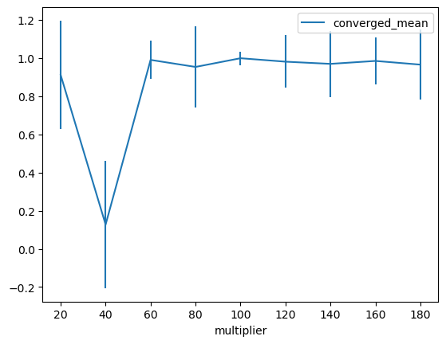

In this article, the various test setup that have been built to facilitate the testing of different performance aspects of an agent. All the tests that have been built upon the [*run_test()*](../reference/simulation.md#olfactory_navigation.simulation.run_test) function which has been described in more detail in the ["How does a simulation work?"](simulation_process.md) tutorial. All these tests are part of the [*test_setups*](../reference/test_setups.md#olfactory_navigation.test_setups) module.

These tests include:

- [All start test](#all-start-test)
- [N start per cell](#n-start-per-cell)
- [Shape robustness test](#shape-robustness-test)
- [Scale robustness test](#scale-robustness-test)

## All start test

Function: *run_all_starts_test()* [reference](../reference/test_setups.md#olfactory_navigation.test_setups.run_all_starts_test)

The "all starts" test allows to quick test all possible start positions of the agent in space. Since the environment has a *start_probabilities* attribute, we can use it to check all the positions where the probability is higher than zero. With this test, we can easily test if there are areas in space where the agent performs better than other areas.

For example, in a 2-dimensional environment, we can plot the start positions that lead to a successful trajectory in blue and the rest in red:

## N start per cell

Function: *run_n_by_cell_test()* [reference](../reference/test_setups.md#olfactory_navigation.test_setups.run_n_by_cell_test)

In the case where the environment is too detailed and therefore would require too many points to test the whole starting area, we can divide the space in "cells" in which we same a number of points n at random to test the performances averaged over these cells. Another scenario where this test can become useful is also when we want a more statistically significant amount of trajectories to draw conclusions about the performance of an agent.

For example, in a 2-dimensional environment, we can divide the space in a 3 by 26 grid of cells and draw 20 random starting points in each cells:

And over each cell we can average the amount of steps required to reach the source leading to the following heatmap:

## Shape robustness test

Function: *test_shape_robustness()* [reference](../reference/test_setups.md#olfactory_navigation.test_setups.test_shape_robustness)

This test is meant test the robustness of an agent to changes in the olfactory plume shape compared to the one it has been trained with. This test, by default, modifies the shape in the x and y direction by increments of 20%, from 20% the size to 200% the size. For each modified environment an ["All start test"](#all-start-test) is run to evaluate the performance. This test compared to the ones defined previously return a list of [SimulationHistory](../reference/simulation.md#olfactory_navigation.simulation.SimulationHistory) instances rather than a single one.

When the test is done, the list of [SimulationHistory](../reference/simulation.md#olfactory_navigation.simulation.SimulationHistory) instances can be analyzed with the [*analyse_shape_robustness()*](../reference/test_setups.md#olfactory_navigation.test_setups.analyse_shape_robustness) function. Following which a heat-map of the performances can be plot for each modifications.

## Scale robustness test

Function: *test_scale_robustness()* [reference](../reference/test_setups.md#olfactory_navigation.test_setups.test_scale_robustness)

This test works a bit in a similar fashion as the ["Shape robustness test"](#shape-robustness-test), as in, it modifies the environment and runs simulations with the ["All start test"](#all-start-test) for a series of values. But in this scenario, instead of modifying the shape of the olfactory plume, we analyse the sampling of the olfactory navigation environment. We imagine the agent has been trained on a n by n environment, we then test its performance on a 10n by 10n environment and n/10 by n/10 environemnt. These environments therefore more or less granularity and detail while maintaining the same olfactory probabilities.

By default, as for the previous test, the environment scale is modified by increments of 20% from 20% scale to 200% scale. And, after analyzing the list of [SimulationHistory](../reference/simulation.md#olfactory_navigation.simulation.SimulationHistory) instance using the [*analyse_scale_robustness()*](../reference/test_setups.md#olfactory_navigation.test_setups.analyse_scale_robustness) function, we can plot the results as follows:

