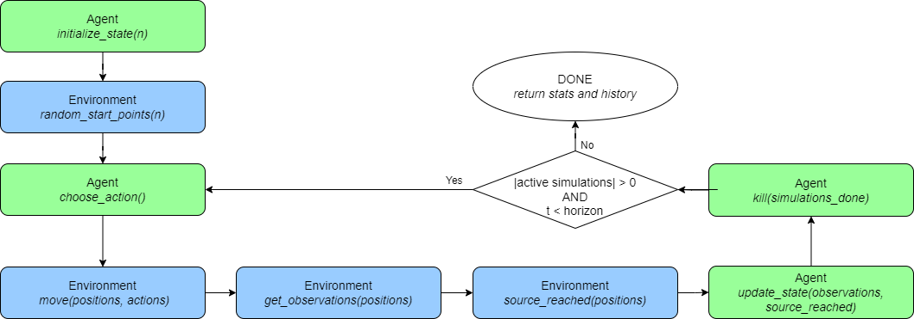
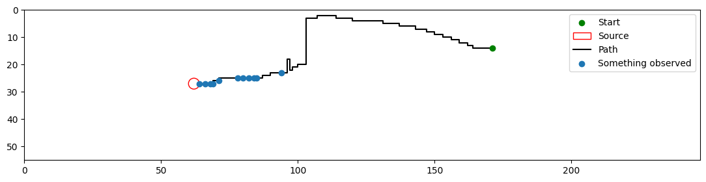

In this article, the [*run_test()*](../reference/simulation.md#olfactory_navigation.simulation.run_test) function, used for simulating an olfactory problem, will be described in detail.


## Process

The *run_test()* function works by, first, initialize the state of the agent. This initialization is made of initializing the positions of the *n* agents within the environment, and asking the agent to initialize it internal state ([*agent.initialize_state(n)*](agent_description.md#state-initialization)).

Then, the simulation loop starts. This loop goes on until the horizon is reached, or all the agents reached the source. Within this loop, first, it is asked of the agents to choose an action to take ([*agent.choose_action()*](agent_description.md#action-choice)). These actions are then used to move the positions of the agents in the physical space (*environment.move()*). From this new position of the agents, an observation is querried (*environment.get_observation()*). Using the new positions, it is also checked whether the agents have reached the source or not (*environment.source_reached()*). The observations and whether or not the agents reached the source is then fed back to the agent in order to update the internal state ([*agent.update_state()*](agent_description.md#state-update)). And finally, the agents that have reached the source are pruned from the simulation by removing their positions from the list and asking the agent to prune those simulations ([*agent.kill()*](agent_description.md#agent-pruning)).

Once the simulation process is over, a [SimulationHistory](../reference/simulation.md#olfactory_navigation.simulation.SimulationHistory) instance is returned. This will be expanded upon in the ["Output"](#output) section of this tutorial.


## Diagram



We can see that the simulation process of the olfactory navigation is mostly an interaction between an agent and the environment it lives in. The simulation (*run_test()*) function simply works as an interface between the agent and its environment. In the diagram the actions performed by the agent are in blue while the one of the environment are in green. We can also note that the position of the agent is never sent to the agent, representing the fact the agent is unaware of it's relative position to the odor source.


## Pseudocode

```
1. agent.initialize_state(n)
2. positions ← environment.random_start_positions(n)
3. for iteration "t" from "time_shift" to "horizon" do
4.      actions ← agent.choose_action()
5.      positions ← environment.move(positions, actions)
6.      observations ← environment.get_observations(positions)
7.      source_reached ← environment.source_reached(positions)
8.      agent.update_state(observations, source_reached)
9.      agent.kill(source_reached)
10.     positions ← positions[not source_reached]
11.     if |positions| = 0 do
12.         break
13.     end if
14. end for
```

## Parameters

Multiple things can be changed when running a test. All of this can be done through the means of parameters. The components that can be change when running a simulation will be listed here along with how they will affect the simulation itself.

| Parameter | Description |
| --------- | ----------- |
| *n* | This parameter controls how many agents will be launched in the simulation at once. With this parameter, *n* positions will be needed and the agent will need to initialize *n* internal states. |
| *start_points* | This parameter controls the strarting positions of the agents in the environment. By default they are picked at random in according to the starting probability distribution of the environment. If this parameter is provided, however, it need to either be a single starting point that will be repeated *n* times, or *n* starting points. |
| *environment* | The environment in which the simulation will happen. By default, it is the environment the agent was trained on. But, if it is provided, this environment will be used instead to test the agent in different circumstances than the ones he has been trained in. |
| *time_shifts* | The environment are based on a time-series of olfactory data, therefore, by default, during the simulation, the olfactory at time *t* is querried and *t* is incremented at each loop of the simulation. But, this can be changed using the *time_shifts* parameter. This parameter allows for the time-slice *t* *+* *time_shifts* to be querried. *time_shifts* can also be a list of *n* time shifts for each agent. |
| *time_loop* | As stated above, the environment's olfactory data comes as a time-series, therefore, there are a limited amount of timestamps available. If the *t* *+* *time_shifts* becomes higher than the amount of timestamps available, we can either stop the simulation or start over from zero by using a modulo operator. This is what the *time_loop* controls, if enabled, the time always starts over at zero, else, the simulations end early. |
| *horizon* | This parameter controls how many loop iterations can happen as part of the simulation. By default, this is set to 1000. |
| *skip_initialization* | The first step of *run_test()* function is the initialization of the internal states of the agents. In some special case, we may want to initialize the agent's states in a custom way compared to the way defined in the *agent.initialize_state()* function, in such case the *skip_initialization* can be enabled to skip the agent initialization step. |


## Output

During the simulation process, the positions, actions and observations are recorded in a [SimulationHistory](../reference/simulation.md#olfactory_navigation.simulation.SimulationHistory) instance and are returned at the end of the *run_test()* function.

This object allows to compute statistics about the performance of the agent ([*summary*](../reference/simulation.md#olfactory_navigation.simulation.SimulationHistory.summary)), easily save the results to csv files ([*save()*](../reference/simulation.md#olfactory_navigation.simulation.SimulationHistory.save)), and plot trajectories ([*plot()*](../reference/simulation.md#olfactory_navigation.simulation.SimulationHistory.plot)).


### Summary

The [*summary*](../reference/simulation.md#olfactory_navigation.simulation.SimulationHistory.summary) attribute is a string summarizing the performance metrics for the simulation process. The performance metrics that are considered are the following:

- Convergence: The percentage of agent that managed to reach the source before the *horizon*.
- Step count: The average amount of steps taken by the agents along the simulation.
- Extra steps: The average amount of extra steps compared to an optimal trajectory taken by the agents along the simulation. 
- Discounted rewards: The average discounted rewards received by the agent. Knowing the agent receives a reward of zero if it doesnt find the source and one if it does. Based on a discount factor *d*, and a trajectory of *l* steps to reach the source, we have a discounted reward of *d*<sup>*l*</sup>. By default the discount factor is of *0.99*.
- Tmin / T: The average of normalized metric computing how close a trajectory is to an optimal trajectory. This metric is computed by dividing the length of the optimal trajectory (*Tmin*) by the amount of steps taken(*T*).

Note: The performance metrics are each displayed with their standard deviation, and both computed over all the trajectories or filtered to only the successful trajectories.


### Trajectories saving

The [*save()*](../reference/simulation.md#olfactory_navigation.simulation.SimulationHistory.save) function allows to record the results of a simulation in a readable .csv file. The information recorded are all the information need to reproduce the trajectory of all agents. This information can be summarized in a table by appending under one another all the trajectories. This table can be viewed as a list of [Pandas](https://pandas.pydata.org/) DataFrame object by querrying the [*simulation_dfs*](../reference/simulation.md#olfactory_navigation.simulation.SimulationHistory.simulation_dfs) attribute.

A sample table of the trajectories on a 2 dimensional envrionment:

| time | y | x | dy | dx | o | done |
| ---- | ---- | ---- | ---- | ---- | ---- | ---- |
| 0 | 14 | 171 |  |  |  |  |
| 1 | 14 | 170 | 0 | -1 | 3.245e-08 | 0 |
| 2 | 13 | 170 | -1 | 0 | 0.0 | 0 |
| ... | ... | ... | ... | ... | ... | ... |
| 196 | 27 | 64 | 0 | -1 | -1.394e-07 | 1 |
| 0 | 15 | 139 |  |  |  |  |
| ... | ... | ... | ... | ... | ... | ... |

Additionally, in this table some extra columns are added giving information about the agent and the environment, then it also saves the horizon, the reward discount, and a column with the timestamps of the iterations to have statistics about the time required to run each iteration. The information saved for the agent and the environment are their name and save location (if it exists) along with some of their respective attributes that required for plotting. These attribute for environment include the amount of dimensions, the source position and radius, and the shape. Whereas, for the agent, it is the olfactory thresholds that are recorded.

The sample shown above is of simulation on a 2 dimensonal environment. But simulations can be performed on higher dimensional environments. This would lead to more columns for the position and displacement to be available. In 3 dimensions, a *z* and *dz* would be added. And for n-dimensional environment it would be *x1*, *x2*, ..., *xn* and similarly for the dispacements. Additionally, a layered environment can also be considered, in which case, a *layer* column would be added to represent which layer of odor is querried at each timestamp.


### Analysis saving

An "analysis" table can also be built. This table summarizes the performance metrics described above for each of the agents and also computes the averages and standard deviations. This table is available as the [*analysis_df*](../reference/simulation.md#olfactory_navigation.simulation.SimulationHistory.analysis_df) attribute.

A sample table of the analysis of the trajectories on a 2 dimensional envrionment:

|  | y | x | optimal_steps_count | converged | reached_horizon | steps_taken | discounted_rewards | extra_steps | t_min_over_t |
| ---- | ---- | ---- | ---- | ---- | ---- | ---- | ---- | ---- | ---- |
| mean |  |  |  | 0.803 | 0.196 | 277.078 | 0.344 | 206.044 | 0.63 |
| standard_deviation |  |  |  | 0.397 | 0.397 | 361.525 | 0.26 | 358.632 | 0.338 |
| success_mean |  |  |  | 1.0 | 0.0 | 100.388 | 0.428 | 29.478 | 0.767 |
| success_standard_deviation |  |  |  | 0.0 | 0.0 | 60.794 | 0.219 | 34.212 | 0.216 |
| run_0 | 14.0 | 171.0 | 120.0 | True | False | 196.0 | 0.139 | 76.0 | 0.612 |
| ... | ... | ... | ... | ... | ... | ... | ... | ... | ... |

As for the *summary* attribute, all the performance metrics are computed both for the full set of trajectories and when the trajectories are filtered to the successful ones only.

Note that if the analysis .csv file has not been generated or does not exists, it is always possible to regenerate it by loading a SimulationHistory object using the [*load_from_file()*](../reference/simulation.md#olfactory_navigation.simulation.SimulationHistory.load_from_file) function.


### Trajectory plot

The [*plot()*](../reference/simulation.md#olfactory_navigation.simulation.SimulationHistory.plot) function allows for one of the trajectories to be plot. It shows the path of the agent from the start point (green dot), and the observations it does along the way (blue dots). The source is marker with the red circle. If the agent querries odors at other layers, it will be marker with crosses of different colors.



Note: the plotting function only works with simulations of environments in 2 dimensions.

## Going Further

Using this simulation function, some more predefined tests have been defined. Some tests are just a predefined way to choose the starting positions ([*run_all_starts_test()*](../reference/test_setups.md#olfactory_navigation.test_setups.run_all_starts_test), or [*run_n_by_cell_test()*](../reference/test_setups.md#olfactory_navigation.test_setups.run_n_by_cell_test)), whereas some modify the environment entirely to test the robustness of the agent ([*test_shape_robustness()*](../reference/test_setups.md#olfactory_navigation.test_setups.test_shape_robustness), or [*test_scale_robustness()*](../reference/test_setups.md#olfactory_navigation.test_setups.test_scale_robustness)).